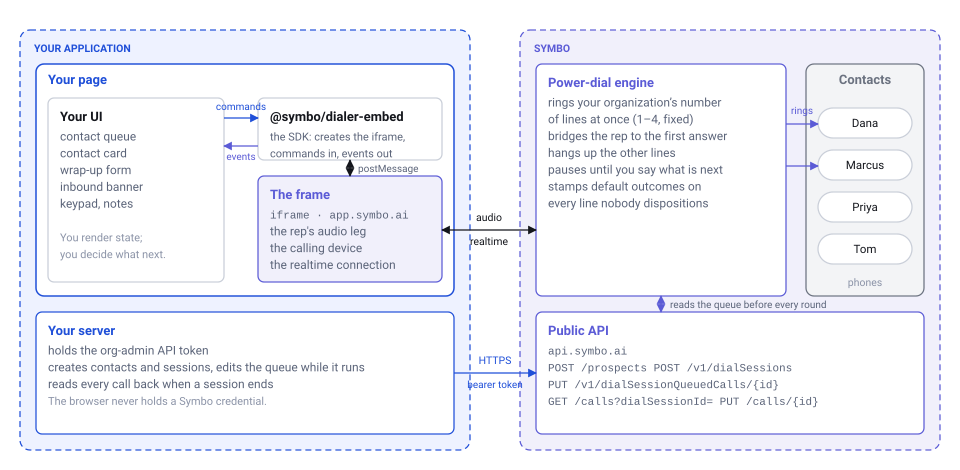
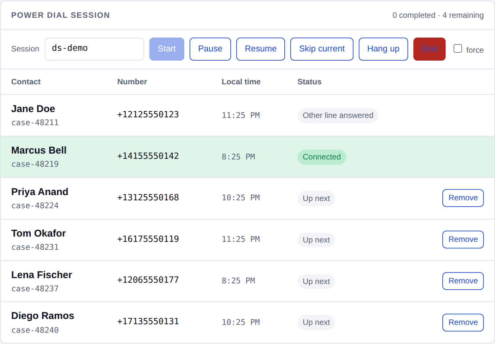
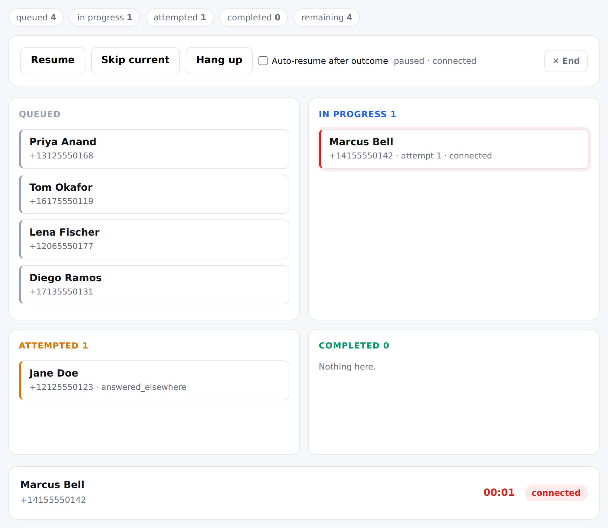
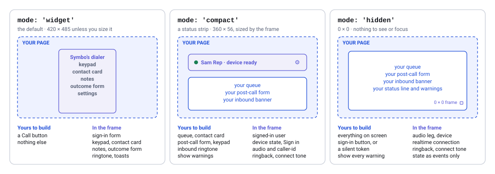
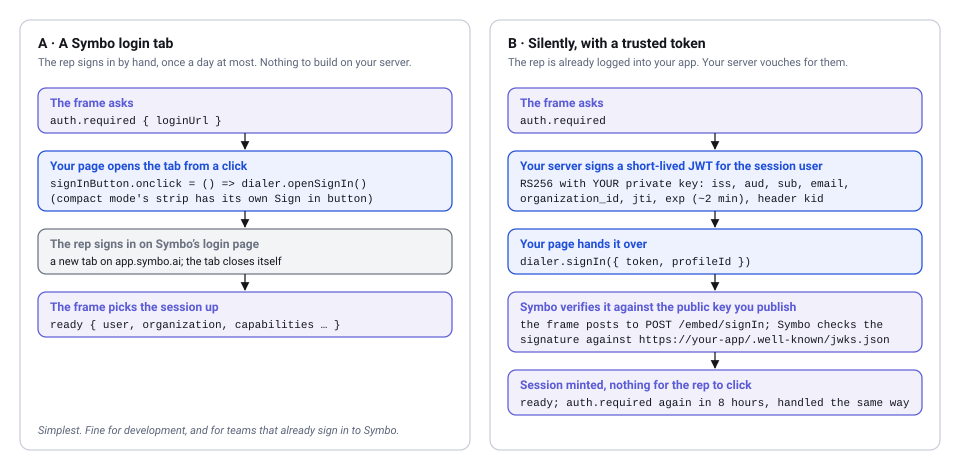
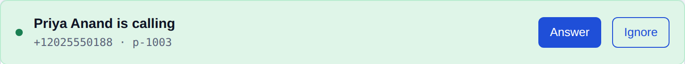
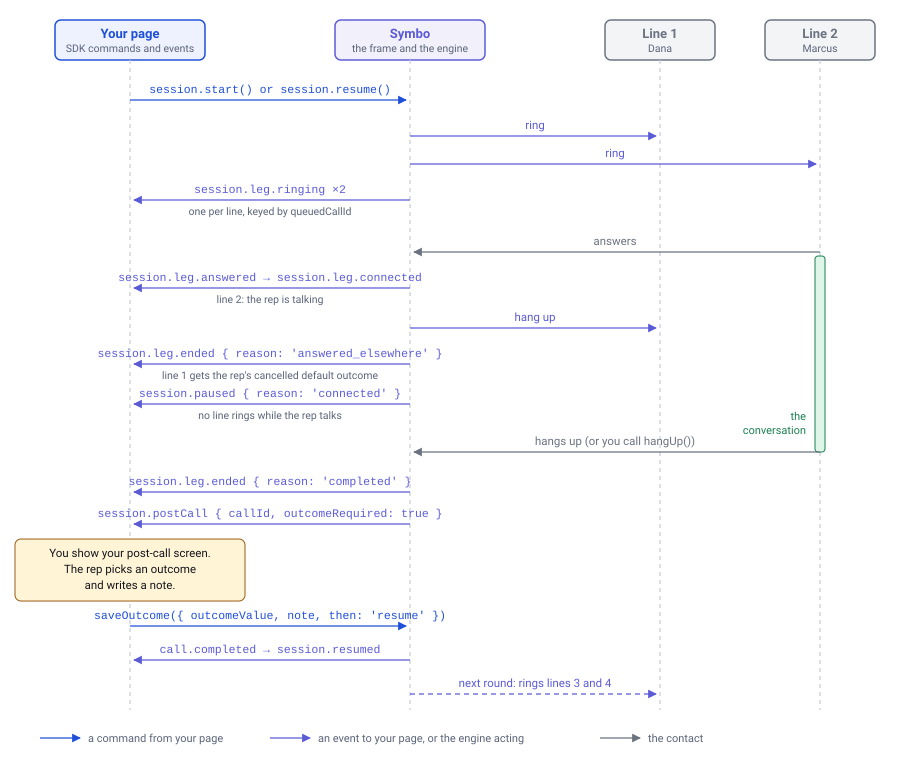
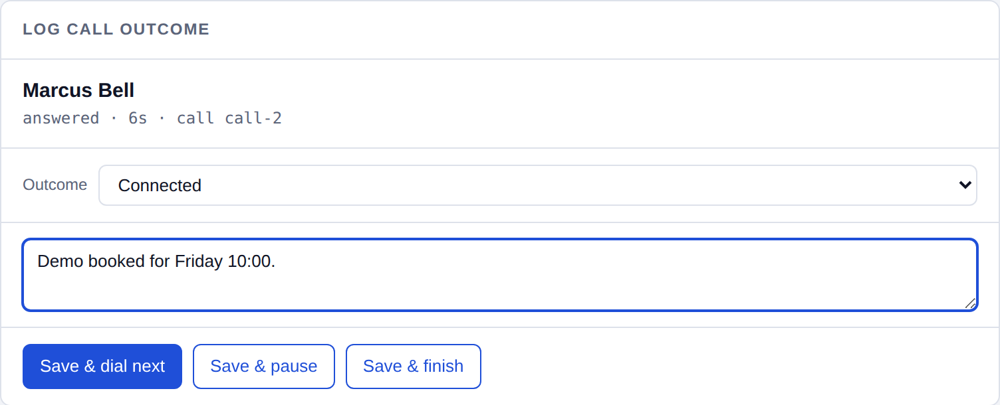
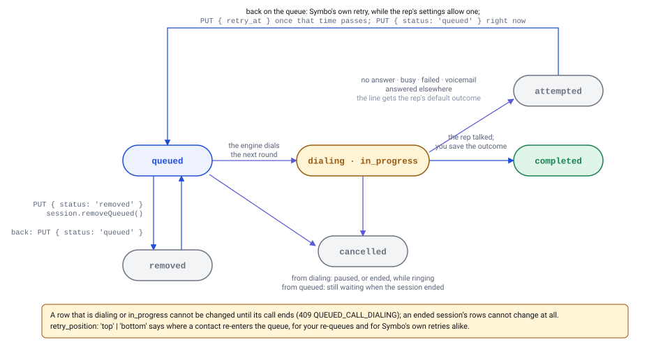

# @symbo/dialer-embed

Embed the Symbo dialer in your own application. The package covers two
different integrations, and this README keeps them apart:

- **The dialer widget.** Symbo's own dialer, in an iframe on your page. Your
  page adds Call buttons; the keypad, the contact card, notes, the outcome
  form and inbound ringing are all Symbo's. One-off calls, one at a time.
- **The power dialer.** Symbo's engine rings several contacts at once from a
  dial session your server created through the Symbo API, and your page
  draws the whole experience — the queue, the post-call form, the inbound
  banner — from events, with Symbo reduced to a status strip or hidden
  entirely.

Both use the same client; they differ in the `mode` you mount with and the
commands you call. [Which one to build](#which-integration-are-you-building)
is the first section below.

```bash
npm install @symbo/dialer-embed
```

The dialer widget, in full:

```js
import { SymboDialer } from '@symbo/dialer-embed'

const dialer = await SymboDialer.mount({
  container: document.getElementById('symbo-dialer'), // Symbo's dialer renders here
})
callButton.onclick = () => dialer.dial({ prospectId: 'p-1001' })
```

The power dialer, in outline (the rest of this README fills it in):

```js
const dialer = SymboDialer.create({
  container: document.getElementById('symbo-dialer'),
  mode: 'compact', // a status strip; or 'hidden' for nothing at all
})
dialer.on('session.leg.ringing', lightUpRow)
dialer.on('session.postCall', showYourPostCallScreen)
await dialer.mount()

await dialer.session.start({ dialSessionId }) // a session your server created
```

Not using a bundler? A script tag gives you the same thing on `window`:

```html
<script src="https://cdn.jsdelivr.net/npm/@symbo/dialer-embed@0.2/dist/symbo-dialer.min.js"></script>
<script>
  const dialer = SymboDialer.create({ container: document.getElementById('symbo-dialer') })
  dialer.mount()
</script>
```

> **Which Symbo release you need** is at the [end](#sdk-versions-and-symbo-releases).
> The session, inbound, audio and sign-in commands in 0.2.0 need the Symbo
> release that carries the power-dial embed; against an earlier one they
> reject with `UNKNOWN_COMMAND`, and `dialer.capabilities` tells you before you
> try.

## Contents

- [Which integration are you building?](#which-integration-are-you-building)
- [How it fits together](#how-it-fits-together)
- [The examples](#the-examples)
- [Three modes: widget, compact and hidden](#three-modes-widget-compact-and-hidden)
- [Signing in](#signing-in)
- [The dialer widget](#the-dialer-widget)
- [The power dialer](#the-power-dialer)
- [Audio devices](#audio-devices)
- [Warnings](#warnings)
- [New Symbo versions and reloads](#new-symbo-versions-and-reloads)
- [API](#api)
- [Events](#events)
- [Error codes](#error-codes)
- [Hidden-mode checklist](#hidden-mode-checklist)
- [SDK versions and Symbo releases](#sdk-versions-and-symbo-releases)

## Which integration are you building?

| | The dialer widget | The power dialer |
| --- | --- | --- |
| What the rep sees | Symbo's dialer, whole, in a 420×485 frame on your page | Your own screens; Symbo is a small status strip (`compact`) or invisible (`hidden`) |
| What you build | A Call button per contact | The queue, the contact card, the post-call form, the inbound banner |
| Where the session lives | — | In Symbo, on the rep's queue: the same dial session the Symbo app shows and can drive, created and edited through the Symbo API |
| How calls are placed | One at a time, with `dialer.dial()` | Several lines at once by Symbo's engine, from a queue your server created with the Symbo API |
| Outcomes and notes | Saved in Symbo's outcome form, inside the frame | Saved by your page with `session.saveOutcome()`, or by your server |
| Inbound calls | The frame rings and answers | Your page rings and answers (`call.incoming`) |
| Server side | None required | Sync contacts, create sessions, edit the queue, read calls back — the **Embedded Dialer** guide in the Symbo API docs |
| Mount with | `mode: 'widget'` (the default) | `mode: 'compact'` or `'hidden'` |
| SDK surface | `mount`, `dial`, `hangUp`, `setContact`, the `call.*` events | All of that, plus `session.*`, `signIn`, `answerIncoming`, `audio.*`, `getState`, the `session.*` events |
| Example | [`example/index.html`](example/index.html) | [`example/collections.html`](example/collections.html) and [`example/power-dial.html`](example/power-dial.html) |

Pick the **widget** when your application only needs a way to place a call and
is happy for the call itself to happen in Symbo's UI: a CRM record with a Call
button, a support console, an internal tool. It is the smallest integration
there is, and the 0.1.x surface.

Pick the **power dialer** when your reps work through lists inside your
application and you want them to stay there while Symbo does the dialing.
Symbo rings several contacts at once, connects the rep to whoever answers
first, and handles the no-answers, retries and default outcomes for you; your
application supplies the list, and Symbo keeps it told, as events, which
contacts are ringing, who answered and when a conversation needs its outcome,
and takes its commands to pause, skip, save an outcome or end. You draw all of
that in your own screens. Your server creates the session through the Symbo
API from contacts it has synced, can drop, re-queue or reschedule a contact
while it runs, and reads every call back when it ends. The session itself
lives in Symbo, on the rep's queue, so a manager can also see and manage it
from the Symbo app. This integration needs a server side for the API calls and
a page that draws the queue and the post-call screen.

Both can live on the same page — `dial()` still works between sessions — and
both go through the same sign-in.

## How it fits together



The SDK creates an iframe served from `app.symbo.ai` and talks to it over
`postMessage`. The frame holds the rep's audio leg, the calling device and the
realtime connection. Your page holds everything the rep sees and decides what
happens next: you send **commands** (`session.start`, `session.saveOutcome`,
`dial`, `answerIncoming`, `audio.set` …) and receive **events**
(`session.leg.ringing`, `session.postCall`, `call.incoming`, `warning` …).

The SDK sets the iframe up for you, with `allow="microphone; autoplay"` and
the mode on the frame URL.

Everything on the **server** side — syncing contacts, creating sessions,
editing the queue while it runs, reading every call back — goes through the
Symbo public API with an org-admin token, and is walked through end to end in
the **Embedded Dialer** guide in the Symbo API documentation. This README is
the browser side.

## The examples

Three pages in [`example/`](example), each self-contained. `npm install &&
npm run demo` serves them, pointed at your Symbo account; add
`?appUrl=http://localhost:3000/example/stub` to run any of them against the
offline stub, which plays the Symbo side of the protocol with no account and
no network.

```
?appUrl=http://localhost:3000/example/stub    the offline stub
?appUrl=https://<your-environment>            any other Symbo environment
?mode=widget|compact|hidden                   start in that mode (collections.html)
?lockLines=2                                  with the stub: an organization that fixes every session's number of lines
?tokenServer=http://localhost:8790&email=…    silent sign-in through example/token-server (collections.html)
```

[`example/token-server`](example/token-server) stands in for your backend
while you try silent sign-in: it makes a keypair, serves the JWKS and mints
tokens, with nothing to install. Its README runs it against the stub and
against Symbo.

`appUrl` is an **origin**, not a path — the SDK appends `/dial?embed=1&mode=…`.

### Dialer widget · `example/index.html`

[**Open it live**](https://gosymbo.github.io/symbo-dialer-sdk/example/) — a
list of cases with Call buttons, a box for dialling any number, and Symbo's
dialer beside them. Everything after the click — ringing, notes, the outcome
form — happens inside the frame. This is the whole of the widget integration,
and the page that shipped with 0.1.x, unchanged.

### Power dialer · `example/collections.html`

The same pretend collections tool, rebuilt on the power dialer: a queue that
lights up as lines ring and connect, a post-call panel, an inbound banner, an
audio-device picker, a mode switch and a live log of everything the dialer
sends back. It also keeps a one-off Call button per contact, to show the two
coexisting.



### Power dialer, minimal · `example/power-dial.html`

The smaller, plainer one: a single file of plain JavaScript that loads the SDK
from jsDelivr, signs in by redirect, starts a dial session you built in Symbo
by its id, and renders the queue as Queued / In progress / Attempted /
Completed boards that contacts move through as the engine works. No build step
and no server of your own — copy the file anywhere and serve the folder. It
picks up a session the rep already has running, so connecting mid-session
lands you on a live board.



## Three modes: widget, compact and hidden

`widget` is the dialer-widget integration; `compact` and `hidden` are the
power-dialer integration. Reps still complete a handshake with Symbo before a
call can be placed: sign in, the microphone permission, the calling device
registering. How much of Symbo they see while doing it is what the mode
decides. All three run the same dialer and answer the same commands; they
differ only in what the frame renders.



| | `mode: 'widget'` (default) | `mode: 'compact'` | `mode: 'hidden'` |
| --- | --- | --- | --- |
| The frame | Symbo's own dialer, the same one its CRM plugins embed: keypad, contact card, notes, outcome form. 420×485 unless you size the iframe | A small Symbo strip — signed-in user, device state, a settings panel for audio and caller id. The SDK sizes the iframe to it and follows the frame's `resize` events | 0×0, `visibility: hidden`, `aria-hidden`. Nothing to see or focus |
| Sign-in | Symbo's login form, inside the frame | A **Sign in** button in the strip opens Symbo's login tab | Your button calls `dialer.openSignIn()`, or your server signs a token for `dialer.signIn({ token, profileId })` |
| Device / mic / realtime state | Shown in the dialer, and sent as events | Shown in the strip, and sent as events | Sent as events only: `ready`, `auth.required`, `warning`, `warning.cleared`, `device.*`, `permission.denied` |
| Audio settings | The dialer's settings tab, and `dialer.audio.*` | The strip's panel, and `dialer.audio.*` | `dialer.audio.*` only |
| Outcome form, notes, keypad | Symbo's | Yours | Yours |
| Inbound ringtone | The frame rings | Silent — play your own on `call.incoming` | Silent — play your own on `call.incoming` |
| Toasts | Symbo's, inside the frame | None — the same states arrive as `warning` | None |

Ringback while lines ring and the connect tone play inside the frame in every
mode. Hidden mode has a [checklist](#hidden-mode-checklist) of things that only
matter when there is nothing on screen.

`?embed=1` with no mode at all is `widget`, which is what it has always meant.
The 0.1.x `hidden: true` option still works and maps onto `mode: 'hidden'`
with a deprecation warning; `hidden: false` keeps its old meaning of
`'compact'`.

## Signing in

`mount()` resolves once a user is signed in inside the frame. Until then Symbo
says `auth.required`, and the mount timer stops — a rep taking their time is
not a timeout. There are two ways through, and you can offer both.



**A · A Symbo login tab.** `auth.required` carries a `loginUrl`. Widget mode
shows Symbo's login form in the frame and compact mode a **Sign in** button
that opens the tab; in hidden mode, or if you want your own button, call
`openSignIn()` **from a click handler** (browsers block tabs opened any other
way). When the rep finishes, the frame picks the session up by itself and
`ready` follows.

```js
const dialer = SymboDialer.create({ container, mode: 'hidden' })

dialer.on('auth.required', () => {
  signInButton.hidden = false
})
signInButton.addEventListener('click', () => dialer.openSignIn())

dialer.on('ready', () => {
  signInButton.hidden = true
})

dialer.mount()
```

**B · Silently, with a signed token.** Your server signs a short-lived
RS256 JWT for the rep who is logged into *your* app, and the page hands it
over. Symbo verifies the signature against a public key you publish as a JWKS
(JSON Web Key Set).

A JWT is a small signed JSON document in three parts: a header, which names
the algorithm and the key that signed it (`alg`, `kid`); a payload, whose
fields are called *claims*; and a signature. `iss` (issuer), `aud`
(audience), `sub` (subject), `jti` (token id), `iat` (issued at), `nbf` (not
before) and `exp` (expires) are standard claim names that every JWT library
knows; `email` and `organization_id` are two more that Symbo reads.

The token's `organization_id` claim names the Symbo organization it is for.
Symbo gives you a `profileId` during setup (see
[Your server's side](#your-servers-side)); one `profileId` can serve several
organizations, and the claim picks which:

```js
const PROFILE_ID = '<your profileId>' // Symbo gives you this

dialer.on('auth.required', async () => {
  try {
    // Your endpoint, on this page's origin, behind your login. It mints for
    // the CURRENT SESSION'S user — never for a user read from the request.
    const r = await fetch('/my-server/symbo-token', { method: 'POST' })
    if (!r.ok) throw new Error(`token endpoint answered ${r.status}`)
    const { token } = await r.json()
    await dialer.signIn({ token, profileId: PROFILE_ID }) // { user }; `ready` follows
  } catch (err) {
    // TOKEN_REJECTED           — Symbo would not accept the JWT: check its signature,
    //                            issuer (iss), audience (aud), expiry (exp) and key id (kid)
    // USER_NOT_PROVISIONED     — Symbo has no rep with that email
    // USER_NEEDS_FIRST_LOGIN   — an org admin who has not signed in to Symbo by hand yet
    //                            (reps never need to: their first sign-in activates them)
    // ORGANIZATION_ID_REQUIRED — the token has no organization_id claim
    // ORGANIZATION_MISMATCH    — that rep is not in the org the token names
    // PROFILE_NOT_CONFIGURED   — the profileId is wrong, or not set up for that org
    // CALLING_NOT_ENABLED      — the rep has no calling seat
    // RATE_LIMITED             — too many sign-ins from this address; wait a minute
    // ORIGIN_NOT_ALLOWED       — this page's origin is not on the list you gave Symbo
    // EMBEDDED_DIALER_DISABLED — the embedded dialer is off for this organization
    // TOKEN_REQUIRED           — your endpoint returned a blank token
    // …and the rest in the error table below.
    // Don't retry in a loop: show a button that calls openSignIn() instead.
    showSignInButton(err)
  }
})
```

Sessions last 8 hours. `auth.required` fires again at expiry; mint another
token and call `signIn()` again. The frame reloads when it does, and `ready`
follows.

**Switching reps.** The rep signed in inside the frame is separate from your
app's login. The frame keeps that rep signed in for up to 8 hours, even if a
different user logs into your app in the same browser, and clearing your
site's cookies or storage does not sign them out. Calling `signIn()` while a
rep is signed in does not switch reps either: it succeeds, with the rep who
is already signed in. To keep the frame's rep matched to the user of your
app, do two things:

1. **When a user logs out of your app,** call `dialer.signOut()` before you
   clear your own session. It resolves once the rep is signed out; the frame
   then reloads with nobody signed in and sends `auth.required`. Your
   `dialer` object and its listeners carry on as before.
2. **Every time `ready` fires,** compare `dialer.user.email` with the email of
   the user logged into your app, ignoring case. If they differ, call
   `signOut()`, and when `auth.required` arrives, sign in the right rep: with
   `signIn({ token, profileId })`, or by showing your button for
   `openSignIn()`.

`signOut()` is refused while the rep is busy: with `SESSION_ACTIVE` while a
power-dial session is running, with `CALL_IN_PROGRESS` during a call or while
one is ringing, and with `POSTCALL_DETAILS_REQUIRED` while the last call
still needs its outcome. Ask the rep to finish, then call it again. A frame
on an older Symbo release does not have `signOut()` and refuses it with
`UNKNOWN_COMMAND`, so check `dialer.hasCapability('signOut')` first.

### Your server's side

Each rep must already be a Symbo user with a calling seat, created with
`POST /v1/users` under the same email your token carries (see the **Getting
Started** guide in the Symbo API docs); a token never creates one. Org admins
must sign in to Symbo once by hand before silent sign-in works for them; reps
don't. Then set up once, and build one endpoint:

1. **A keypair and a JWKS.** An RSA 2048 keypair; the private key stays on
   your server. Publish the public half as a JWKS at a public HTTPS URL, with
   no login, WAF challenge or IP allowlist in front of it:

   ```bash
   openssl genpkey -algorithm RSA -pkeyopt rsa_keygen_bits:2048 -out private.pem
   ```

   ```js
   // Node: the JWKS to publish, derived from the private key
   const fs = require('fs')
   const crypto = require('crypto')
   const jwk = crypto.createPublicKey(fs.readFileSync('private.pem')).export({ format: 'jwk' })
   const jwks = { keys: [{ ...jwk, use: 'sig', alg: 'RS256', kid: '2026-09' }] }
   // GET https://your-app.example/.well-known/jwks.json → jwks
   ```

   The `kid` (key id) is any string you choose; a date works. Every token
   carries it in the JWT's own header, next to `alg: RS256` (not an HTTP
   header), and it must match the `kid` of a key in your JWKS.

2. **Send Symbo the details** at **team@symbo.ai**:

   - **Your JWKS URL.**
   - **An issuer** (`iss` in the token, the standard JWT "issuer" claim): a
     fixed string that names your app as the one signing the tokens. Your
     app's URL is the usual choice, such as `https://your-app.example`.
   - **An audience** (`aud` in the token, the standard JWT "audience"
     claim): a fixed string that marks the tokens as meant for Symbo. Use
     `symbo-embedded-dialer`; it does not need to be a URL.
   - **Your page's origins**: the `https://` origin of every page that
     embeds the dialer, test and live, with no wildcards.
   - **Your Symbo organizations**: the name of each organization whose reps
     will sign in this way.

   Every token must carry the issuer and the audience exactly as you sent
   them; they are compared character for character, so a trailing slash
   makes a different issuer. Symbo records these details as your sign-in
   profile and sends back its `profileId`, plus the uuid of each Symbo
   organization the profile covers. Neither is a secret: the `profileId`
   goes in your page, in the `signIn()` call, and each uuid goes in the
   token's `organization_id` claim. To change the issuer, audience, JWKS URL
   or page origins later, email Symbo and wait for the reply before you
   switch.
3. **The token endpoint.** `POST`, on your page's origin, behind your login.
   It signs, with RS256 and your `kid` in the header:

   | Claim | Value |
   | --- | --- |
   | `iss` | Your issuer, exactly as you sent it to Symbo |
   | `aud` | Your audience, exactly as you sent it to Symbo |
   | `sub` | Your own user id for the rep, as a string |
   | `email` | The rep's email, from your session; it must match their email in Symbo. Only an address your app has verified belongs to that user |
   | `organization_id` | The uuid Symbo sent for the organization this rep belongs to. With several organizations, look it up from the logged-in user's account on your side, not from the request |
   | `jti` | A fresh random id per token |
   | `iat` (issued at) | The current time, in whole seconds since the Unix epoch (not milliseconds) |
   | `nbf` (not before) | A few seconds before `iat` |
   | `exp` (expires) | Two minutes after `iat` |

[`example/token-server`](example/token-server) does steps 1 and 3 (the
keypair, the JWKS and the tokens) with nothing to install; `token.js` is the
part to read. You still send the step 2 email yourself. The **Embedded Dialer** guide in
the Symbo API docs, under *Setting up silent sign-in*, has an Express
version, key rotation, what to do if a key leaks, and a troubleshooting table
for first-run `TOKEN_REJECTED`s.

`signIn()`, `signOut()` and `getState()` work before `ready`; every other command rejects
with `NOT_READY` until then. If the session expires mid-day, `auth.required`
is sent again and `dialer.ready` goes back to `false`.

`mountTimeoutMs` (default 30 000) only covers the frame never saying anything
at all — a wrong `appUrl`, an unreachable environment, a Symbo build without
the embed surface — and rejects `mount()` with `MOUNT_TIMEOUT`.

## The dialer widget

Mount with no `mode` (or `mode: 'widget'`) and Symbo's dialer renders in your
container, 420×485 unless you size the iframe. The rep signs in inside it,
and every call — placed from your button or arriving inbound — is handled
there: ringing, the contact card, notes, the outcome form. Your page needs
`dial()` and, at most, the `call.*` events to know what state the line is in.

The two things below are the widget integration. Both also work with the
compact and hidden modes between power-dial sessions, which is where the
notes about "no outcome form" apply.

### One-off calls

For a "Call" button on a single contact, outside a session:

```js
const { callId } = await dialer.dial({ prospectId: 'p-1001', phoneNumberId: 'pn-2' })
// or, for a number you hold no Symbo record for:
const { callId } = await dialer.dial({ number: '+12125550123', externalId: 'case-48211' })
```

`dial()` resolves when the carrier reports the call ringing, which is where
the `callId` comes from. A `callId` of `null` is not a failed call: it comes
back **fast** for a call that failed outright or was answered on another
device, and after about 15 s for one that rings for a long time. Either way
`call.started`, `call.ringing` and `call.ended` carry the id once it is known,
so key your record off the events rather than off this resolution alone.

Events: `call.started` → `call.ringing` → `call.answered` (far-end pickup) →
`call.ended { reason, durationSeconds }` → `call.postCall`. That is the end of
it: compact and hidden mode show no outcome form (widget mode shows Symbo's
own), and there is no command for saving a one-off outcome
(`session.saveOutcome` is for the call in front of the rep in a session, and
refuses with `NO_ACTIVE_SESSION` outside one). Render your own post-call screen
on `call.postCall` and save it from your server with `PUT /calls/{id}`; the
completion signal is that response — not an event in the page.
`contact.matched` fires when Symbo recognises a number you dialled without a
prospect. `dial()` is refused with `SESSION_ACTIVE` while a session runs: the
rep's line is busy for the whole session.

`externalId` comes back on the call events and on the call record, which is
how a call lands against your record without a prospect. Prefer `prospectId`
when you have one.

### Inbound calls

In compact and hidden mode the frame plays **no** ringtone — widget mode rings
by itself. Play your own on `call.incoming`, and stop it when the call is
answered, ignored, or ends:



```js
dialer.on('call.incoming', ({ callId, from, prospectId, prospectName }) => {
  ringtone.play()
  showBanner(prospectName || from, {
    answer: () => dialer.answerIncoming(), // → { callId }; then call.answered …
    ignore: () => dialer.ignoreIncoming(),
  })
})
dialer.on('call.ended', ({ callId }) => {
  if (callId === ringingCallId) ringtone.pause()
})
```

An answered inbound call ends the way a one-off call does — `call.ended` →
`call.postCall`, and the outcome is yours to save with `PUT /calls/{id}`.

An inbound call that arrives while a session is active, or while a call is
up, is not offered to the page: it follows the rep's normal no-answer routing
(voicemail, forwarding). One inbound call rings at a time.

## The power dialer

Mount with `mode: 'compact'` or `'hidden'`, and draw the rest yourself. The
engine that dials lives on Symbo's servers. It rings the session's number of
lines at once (1–4, which you set, unless your organization locks it;
`dialer.concurrentCalls` tells you), bridges the rep to the first answer,
hangs up the rest, and pauses until you say otherwise. The session is a Symbo dial session like any other — it
sits on the rep's queue in Symbo, the rep can run it from the app, an admin can
watch it there and end or reassign it, and your page sees those actions as
events. Through the API and the SDK
you decide what goes on the queue and in what order, which of a contact's
numbers is dialled, which outcome each conversation gets, and what happens
after each call; your page draws the queue and the post-call screen.

### 1. Your server creates the session

Every contact in a queue is a Symbo prospect first. Sync your contacts once
(`POST /prospects`, then `PUT` for changes), keep the returned prospect id on
your record, and build sessions from those ids:

```http
POST /v1/dialSessions
{
  "name": "Tuesday follow-ups",
  "owner": "<rep user id>",
  "contacts": [
    { "prospect_id": "p-1001", "phone_number_id": "pn-1" },
    { "prospect_id": "p-1002" }
  ],
  "use_auto_timezone": false,
  "concurrent_calls": 2,
  "skip_duplicates": true
}
```

The response carries the session id and its `queued_calls`. Hand the id to
your page. `concurrent_calls` is how many lines the session rings at once, 1
to 4; omitted, it rings one. When your organization locks the number, the lock
wins, and the response's `concurrent_calls` says what the session will ring.
The retry rules and the default outcomes for unanswered lines are not
per-session settings: they come from the organization's power-dial settings
in Symbo, or each rep's own where the organization has not locked them. The full request and
response, the filters, and what each rejection reason means are in the
**Embedded Dialer** guide.

### 2. The page starts it

```js
const { dialSessionId, concurrentCalls } = await dialer.session.start({
  dialSessionId,
  concurrentCalls: 2, // optional: saved on the session before its first round
})
```

The frame takes the session off hold, joins the rep's audio leg, and the
engine dials. From here on you render events. A `concurrentCalls` other than
your organization's locked number is refused with `CONCURRENT_CALLS_LOCKED`
before anything is dialed.

### 3. What a round of dialing looks like



The same round, as the events arrive:

```
session.started { dialSessionId, concurrentCalls: 2 }
session.queue.updated { counts }

  session.leg.ringing   { queuedCallId: q-1, prospectId: p-1001, number, from }   ─┐ several
  session.leg.ringing   { queuedCallId: q-2, prospectId: p-1002, number, from }   ─┘ at once

  session.leg.answered  { queuedCallId: q-2 }
  session.leg.connected { queuedCallId: q-2, callId }        ← the rep is talking
  session.leg.ended     { queuedCallId: q-1, reason: 'answered_elsewhere' }
  session.paused        { reason: 'connected' }              ← the engine waits

  … the call …

  session.leg.ended     { queuedCallId: q-2, reason: 'completed' }
  session.postCall      { callId, queuedCallId: q-2, prospectId, answered: true,
                          durationSeconds, outcomeRequired }

  ↓ you render your post-call screen and save the outcome

  session.saveOutcome({ callId, outcomeId, note, then: 'resume' })
  call.completed        { callId, outcomeId, outcome, disposition, note, … }
  session.resumed
  session.leg.ringing   { queuedCallId: q-3 }  session.leg.ringing { queuedCallId: q-4 } …
```

The connected call's `session.leg.ended` and `session.postCall` can arrive in
either order (`session.postCall` comes first when the rep hangs up or skips),
so don't let one handler depend on the other having run.

A round where nobody answers needs nothing from you: each leg ends with its
reason (`no_answer`, `busy`, `failed`), Symbo records the attempt with the
default outcome, and the engine moves on to the next round by itself.
When the queue runs out you get `session.noMoreCalls` and then `session.ended
{ counts }`.

Every `session.leg.*` payload names the queued call (`queuedCallId`), the
prospect (`prospectId`, `prospectName`), the number, the `from` number and —
once a call exists — the `callId`. Key your rows on `queuedCallId`; join to
your records on `prospectId`; join to the call records you read back from the
API on `callId`.

### 4. The post-call step

`session.postCall` is your cue. The engine is paused, and with
`outcomeRequired: true` it will not resume until the conversation has an
outcome — so this panel is what keeps the session moving.



```js
dialer.on('session.postCall', ({ callId, prospectId, durationSeconds, outcomeRequired }) => {
  showPostCallScreen({ callId, prospectId, durationSeconds })
})

// From your Save button:
const { outcomeId } = await dialer.session.saveOutcome({
  callId,                      // defaults to the call waiting for its outcome
  outcomeValue: 'MEETING_BOOKED', // or outcomeId, from GET /v1/callOutcomes
  note: 'Demo booked for Friday 10:00.',
  callFields: { c_meeting_at_4821: '2026-09-25T10:00:00-07:00' },
  then: 'resume',              // 'resume' (next round), 'pause', or 'end'
})
```

`call.completed` follows the save. You can save from your server instead
(`PUT /calls/{id}`) and then call `dialer.session.resume()`; `saveOutcome` is
the same write done from the page in one step.

### 5. Pause, resume, skip, end

| You call | What happens |
| --- | --- |
| `session.pause()` | Lines that are ringing are hung up (they get the cancelled default outcome). A connected call is **never** cut. The engine stays paused after the call until you resume |
| `session.resume()` | Dials the next round. Refused with `OUTCOME_PENDING` while a call is waiting for its outcome, and with `CALL_IN_PROGRESS` while a contact is still on the line (hang up or `skipCurrent()` first) |
| `session.saveOutcome({ …, then })` | Saves the outcome, note and call fields on the call, then `'resume'` (next round), `'pause'` (stay paused) or `'end'`. With `'pause'` on a call that has ended and whose post-call step has nothing left to fill in, `session.paused { reason: 'requested' }` follows at once and `getState()` reads `paused`; otherwise no event is sent and it keeps reading `connected` or `post_call`. If `end()` was asked for during the call, or an admin closed the session, a `'pause'` save completes that and `session.ended` arrives instead. `'resume'` is refused with `REALTIME_DISCONNECTED`, before anything is saved, while realtime is down |
| `session.skipCurrent()` | Hangs up the connected call and skips its outcome |
| `hangUp()` | Hangs up the connected call (→ `session.postCall`), or cancels ringing lines |
| `session.removeQueued(queuedCallId)` | Drops a queued contact from this session. Refused with `QUEUED_CALL_DIALING` once its line is ringing |
| `session.end({ force })` | Ends the session. Refused with `CALL_IN_PROGRESS` over a connected call unless `force: true`; the call survives either way. Resolves with `{ counts }` |
| `session.getQueue()` | `{ dialSessionId, counts, queue: [{ queuedCallId, prospectId, prospectName, number, status, order, attempts, lastCallId, lastOutcomeId }] }` |
| `session.setConcurrentCalls(n)` | Rings `n` lines, 1 to 4, from the next round; lines already ringing are neither hung up nor added to. Sends `session.concurrentCallsChanged` when the number changes; asking for the current number just resolves. Refused with `CONCURRENT_CALLS_LOCKED` when your organization locks a different number (`dialer.concurrentCallsLocked`). Check `dialer.hasCapability('concurrentCalls')` first |
| `getState()` | Everything at once: `{ signedIn, deviceReady, mode, powerDialing, concurrentCalls, concurrentCallsLocked, updateAvailable, session, call, incoming, warnings }` |

Things the engine decides on its own, and that you should expect: it retries
an unanswered contact on the retry schedule, and rotates
through the contact's numbers unless you pinned one; it skips contacts outside
the session's timezone and phone-type filters without an event; unanswered and
cancelled legs get the default outcomes; the rep can also drive the
session from inside Symbo, in which case you see the same events. Only the
session's owner can dial, skip or pause it: an admin who opens it in Symbo
watches it, and can end, reassign or split it or change its settings, each of
which reaches you as `session.admin`.

### 6. The queue while it runs

Apart from `session.removeQueued()`, every change to the queue is made from
your server, on the queued call's id: `PUT /v1/dialSessionQueuedCalls/{id}`
with `status`, `retry_at`, `retry_position: 'top' | 'bottom'` or
`phone_number_id`. The engine reads the queue before every round, and the
frame sends `session.queue.updated { counts }` as its counts change. Edits
made to the queue in the Symbo app, such as moving every matching call at once
from its calls table, are not pushed to your page: the engine applies them on
its next round, and `session.getQueue()` or `GET /v1/dialSessionQueuedCalls`
shows them straight away.



`counts` on `session.queue.updated`, `session.ended` and `getState()` is
`{ queued, dialing, attempted, completed, cancelled, removed, remaining }`.
These count queue rows. For how many of the session's *calls* carry an
outcome, read `counts.outcomes_saved` on `GET /v1/dialSessions/{id}` — it is
not on these events, because a session can hold several calls per row.

## Audio devices

```js
const { microphones, speakers, selected } = await dialer.audio.list()
await dialer.audio.set({ microphoneId: microphones[1].id }) // resolves with the same shape
dialer.on('audio.devicesChanged', renderPicker) // a headset was plugged in
```

Device labels are only available once the microphone permission has been
granted; before that the lists are empty or unnamed, and `audio.list()` can
be refused with `DEVICE_NOT_READY`. The rep's choice persists inside Symbo, so
it matches what Symbo's own UI shows in widget and compact mode, and survives
reloads.

## Warnings

Anything Symbo's own UI would show as a problem arrives as a `warning`
with a code, and is withdrawn with `warning.cleared`. `dialer.warnings` is a
`Map` of the ones currently raised. In hidden mode these events are the only
way the rep learns about a problem, so show them.

| Code | Meaning |
| --- | --- |
| `NOT_SIGNED_IN` | No user session in the frame (`auth.required` says how to fix it) |
| `REALTIME_DISCONNECTED` | The frame lost its realtime connection. `session.start` / `resume`, and `saveOutcome` with `then: 'resume'`, are refused until it is back |
| `DEVICE_NOT_READY` / `DEVICE_ERROR` | The calling device is not registered, or failed to |
| `MIC_PERMISSION_DENIED` | The microphone permission was denied. `permission.denied` fires at the same time |
| `EMBED_NOT_ENABLED` | Embedding is not enabled for this organisation |
| `POWER_DIALING_NOT_ENABLED` | This rep has no power-dialing seat |
| `HIJACK_MODE` | The rep's calling is in an admin-controlled state |

## New Symbo versions and reloads

When Symbo releases a new version, the frame does not reload itself for it:
that would cut off whatever the rep is doing. It tells you instead, and you
choose the moment.

```js
dialer.on('update.available', () => showUpdateButton()) // also dialer.updateAvailable, and on ready

updateButton.onclick = async () => {
  try {
    await dialer.reload() // { reloading: true }; frame.reloaded and a fresh ready follow
  } catch (err) {
    // SESSION_ACTIVE / CALL_IN_PROGRESS / POSTCALL_DETAILS_REQUIRED: try again between calls
  }
}
```

`reload()` is refused for the same reasons as `signOut()`, and the rep stays
signed in. Check `dialer.hasCapability('reload')` first.

A frame can also reload without you asking: the browser discards a background
tab, or the rep signs out of Symbo in another tab. Either way you get
`frame.reloaded { requested }` before the new `ready` (or `auth.required`),
and `dialer.ready` is `false` in between. Whatever the old frame held is gone:

- **A session running in it** is paused on Symbo's side. Call
  `session.start({ dialSessionId })` again to pick it up.
- **A call waiting for its outcome** can no longer be saved with
  `session.saveOutcome`. Save it from your server with `PUT /calls/{id}`; the
  `callId` came with `session.postCall`.

So keep your own copy of what you need to carry on — the session you started,
the call waiting for its outcome — from the events as they arrive, or from a
`dialer.getState()` snapshot taken from time to time, rather than relying on
the frame to still hold it.

## API

### Creating a client

| | |
| --- | --- |
| `SymboDialer.create(options)` | Returns a client without touching the page. Attach listeners, then `mount()` |
| `SymboDialer.mount(options)` | `create(options).mount()` |
| `dialer.mount()` | Creates the iframe. Resolves with the client on `ready`; rejects with `MOUNT_TIMEOUT` if the frame never answers, or with `EMBED_NOT_ENABLED` / `ORIGIN_NOT_ALLOWED` if it answers by refusing the page; calling it again returns the same promise, settled the same way — a client whose mount was refused cannot be retried, so make a new one |
| `dialer.destroy()` | Removes the iframe and its listeners; anything still pending rejects with `DESTROYED` |

Options: `container` (required), `appUrl` (an origin; default
`https://app.symbo.ai`), `mode` (`'widget'` \| `'compact'` \| `'hidden'`,
default `'widget'`), `mountTimeoutMs`
(default 30 000), `commandTimeoutMs` (default 15 000). `commandTimeoutMs` does
not apply to `dial()`, which always allows at least 25 s: the frame itself
waits up to 15 s for the carrier to report the call ringing, and a shorter
budget here would reject a call that has really been placed.

### Commands

Every command returns a promise that settles on Symbo's answer: it resolves
with the answer's data, or rejects with a `SymboDialerError` whose `.code` is
one of the [error codes](#error-codes) and whose `.message` says why.

| Command | Resolves with |
| --- | --- |
| `dial({ number \| prospectId, phoneNumberId?, externalId?, externalObjectType?, fullName? })` | `{ callId }` — `callId` is `null` when the carrier never reported the call ringing |
| `hangUp()` | `{}` |
| `setContact({ … })` | `{}` |
| `getState()` | the state object above |
| `signIn({ token, profileId })` | `{ user }` |
| `reload()` | `{ reloading }`. The frame then reloads, the rep still signed in: `frame.reloaded { requested: true }` and `ready` follow. Refused like `signOut()`. See [New Symbo versions and reloads](#new-symbo-versions-and-reloads) |
| `signOut()` | `{ signedOut }`, false when nobody was signed in. The frame then reloads signed out and says `auth.required`. Refused with `SESSION_ACTIVE` / `CALL_IN_PROGRESS` / `POSTCALL_DETAILS_REQUIRED` while a session, a call (ringing or up) or its required outcome is pending |
| `openSignIn()` | the opened `Window` (synchronous; throws `NO_LOGIN_URL` / `POPUP_BLOCKED`). Wait for `ready`, not for that window to close: under `Cross-Origin-Opener-Policy: same-origin` the handle is severed when the login page loads and starts reading `closed === true` |
| `answerIncoming()` | `{ callId }` |
| `ignoreIncoming()` | `{}` |
| `audio.list()` | `{ microphones, speakers, selected }` |
| `audio.set({ microphoneId?, speakerId? })` | same as `audio.list()` |
| `session.start({ dialSessionId, concurrentCalls? })` | `{ dialSessionId, concurrentCalls }` |
| `session.pause()` / `session.resume()` / `session.skipCurrent()` | `{}` |
| `session.end({ force? })` | `{ counts }` |
| `session.removeQueued(queuedCallId)` | `{}` |
| `session.getQueue()` | `{ dialSessionId, counts, queue }` |
| `session.saveOutcome({ callId?, outcomeId?, outcomeValue?, note?, callFields?, then })` | `{ callId, outcomeId }` |
| `session.setConcurrentCalls(n \| { concurrentCalls })` | `{ dialSessionId, concurrentCalls }` |

### Listening

`on(event, handler)` returns an unsubscribe function; `once(event, handler)`
and `off(event, handler)` do what they say. `on('*', (name, payload) => …)`
receives everything.

### Properties, filled from `ready`

`dialer.ready`, `dialer.user { id, name, email }`, `dialer.organization { id, name }`,
`dialer.capabilities` (with `dialer.hasCapability(name)`), `dialer.concurrentCalls`,
`dialer.concurrentCallsLocked`, `dialer.updateAvailable`, `dialer.deviceReady`,
`dialer.powerDialing`, `dialer.mode`, `dialer.warnings`, `dialer.loginUrl`
(from the last `auth.required`). `dialer.updateAvailable` also turns true on
`update.available`.

`dialer.concurrentCalls` is the number of lines the running session rings,
or, with none running, your organization's locked number, or one. A session
you start rings the `concurrent_calls` it was created with unless
`session.start` passes `concurrentCalls`. It follows `session.start()`,
`session.started`, `session.concurrentCallsChanged`, `setConcurrentCalls()`
and `session.ended`.
`dialer.concurrentCallsLocked` is true when your organization fixes that number
for every session.

### Exports

`SymboDialer`, `SymboDialerError`, `COMMANDS`, `EVENTS`, `ERRORS`, `WARNINGS`,
`CLIENT_ERRORS`, `MODES`, `RESULT`, `PROTOCOL_VERSION`.

## Events

| Event | Payload |
| --- | --- |
| `ready` | `{ protocolVersion, user, organization, mode, capabilities, deviceReady, powerDialing, concurrentCalls, concurrentCallsLocked, updateAvailable }` |
| `update.available` | `{}` — a newer Symbo version is ready; `dialer.reload()` picks it up |
| `frame.reloaded` | `{ requested }` — sent by the SDK itself when a frame that had said `ready` loads again, before its new `ready`. `requested` is true after `reload()`. See [New Symbo versions and reloads](#new-symbo-versions-and-reloads) |
| `auth.required` | `{ loginUrl }` — once per unauthenticated state; again if the session expires |
| `device.ready` / `device.error` | `{}` / `{ code, message }` |
| `permission.denied` | `{ permission: 'microphone' }` |
| `warning` / `warning.cleared` | `{ code, message }` / `{ code }` |
| `call.started` | `{ callId, number, from, externalId, prospectId }` |
| `call.ringing` | `{ callId, number, from }` |
| `call.incoming` | `{ callId, from, prospectId, prospectName }` |
| `call.answered` | `{ callId }` — the far end picked up |
| `call.ended` | `{ callId, reason, durationSeconds }` |
| `call.postCall` | `{ callId, prospectId, answered, durationSeconds, outcomeRequired }` |
| `call.completed` | `{ callId, externalId, prospectId, outcomeId, outcome, disposition, dispositionGroup, note, durationSeconds }` — after a save made through `session.saveOutcome` succeeded. A one-off outcome, saved from your server, does not produce it |
| `contact.matched` | `{ number, externalId, prospect: { id, fullName } }` |
| `audio.devicesChanged` | same shape as `audio.list()` |
| `session.started` | `{ dialSessionId, concurrentCalls, concurrentCallsLocked }` |
| `session.paused` | `{ dialSessionId, reason: 'connected' \| 'requested' }` |
| `session.resumed` | `{ dialSessionId }` — when the engine dials on. A resume that already knows the queue is empty sends `session.noMoreCalls` instead; one that finds it empty on the next fetch sends `session.noMoreCalls` right after |
| `session.ended` / `session.noMoreCalls` | `{ dialSessionId, counts }` |
| `session.leg.ringing` / `.answered` / `.connected` / `.ended` | `{ dialSessionId, callId, queuedCallId, prospectId, prospectName, number, from, status, reason }` — `reason` on ended: `answered_elsewhere \| no_answer \| busy \| cancelled \| failed \| completed` |
| `session.postCall` | `{ dialSessionId, callId, queuedCallId, prospectId, answered, durationSeconds, outcomeRequired }` |
| `session.queue.updated` | `{ dialSessionId, counts }` |
| `session.admin` | `{ dialSessionId, action }` |
| `session.concurrentCallsChanged` | `{ dialSessionId, concurrentCalls, concurrentCallsLocked }` — the number of lines or the lock changed: through `setConcurrentCalls()`, the rep or an admin in Symbo, or your organization's lock. It applies from the next round. A lock change with no session running arrives with `dialSessionId: null` and the number a session now gets |
| `resize` | `{ width, height }` — applied in widget and compact mode, ignored in hidden. Only the compact strip sends it; widget mode sizes itself once, from `ready` |
| `error` | `{ code, message }` — a refusal that was not an answer to a command |

Events are good for driving your UI in the moment. For anything you need to
keep, read the call records back from the API — `GET /calls?dialSessionId=…`
returns every leg of a session with its outcome — because events in a page
are not durable.

## Error codes

A refused command rejects with a `SymboDialerError` carrying one of these on
`.code`. They are exported as `ERRORS`.

| Code | Meaning |
| --- | --- |
| `NOT_SIGNED_IN` | No user in the frame |
| `CALLING_NOT_ENABLED` / `POWER_DIALING_NOT_ENABLED` | The rep's seat lacks calling / power dialing |
| `EMBED_NOT_ENABLED` / `ORIGIN_NOT_ALLOWED` | Embedding is off for the org, or your origin is not on its list |
| `NEEDS_SETUP` | No activated outbound number, or no calling device |
| `DEVICE_NOT_READY` / `MIC_PERMISSION_DENIED` | The device is not registered / the microphone was denied |
| `HIJACK_MODE` | The rep's calling is in an admin-controlled state |
| `INVALID_NUMBER` / `PROSPECT_NOT_FOUND` | `dial()` had nothing usable to dial |
| `CALL_IN_PROGRESS` / `NO_ACTIVE_CALL` | A call is up when it must not be / there is none to act on |
| `SESSION_ACTIVE` | A session is running, so a one-off dial or inbound answer is refused |
| `POSTCALL_DETAILS_REQUIRED` | The last one-off call still needs an outcome |
| `NO_INCOMING_CALL` | Nothing is ringing |
| `AUDIO_DEVICE_NOT_FOUND` | Unknown device id |
| `TOKEN_REQUIRED` / `TOKEN_REJECTED` | `signIn()` was given a blank token (none at all is `INVALID_OPTIONS`) / Symbo would not accept the one it got, or could not finish the sign-in; `err.message` gives the reason |
| `PROFILE_NOT_CONFIGURED` | The `profileId` is wrong, or not set up for the organization the token names |
| `ORGANIZATION_ID_REQUIRED` / `ORGANIZATION_MISMATCH` | The token carries no `organization_id` claim / names an organization the rep is not in |
| `USER_NOT_PROVISIONED` / `USER_NEEDS_FIRST_LOGIN` | Symbo has no such rep / an org admin has not signed in to Symbo by hand yet (reps never need to: their first sign-in activates them) |
| `EMBEDDED_DIALER_DISABLED` | `signIn()` for an organisation without the embedded dialer |
| `ACCOUNT_SETUP_INCOMPLETE` / `OTP_REQUIRED` / `ACCOUNT_SUSPENDED` / `ACCOUNT_INACTIVE` / `SUBSCRIPTION_REQUIRED` | `signIn()` refused by Symbo's own login rules: the rep's account is unfinished, needs a verified phone, is suspended or inactive, or the organisation has no active subscription. Fixed in Symbo, not in your code |
| `RATE_LIMITED` | Too many `signIn()` calls from one IP address in a short time; wait a minute |
| `REALTIME_DISCONNECTED` | The frame's realtime connection is down; try again shortly |
| `SESSION_NOT_FOUND` / `SESSION_NOT_STARTABLE` / `SESSION_ALREADY_ACTIVE` | `session.start` problems: not visible to this rep, ended or on another rep's queue, or a session is already loaded |
| `NO_ACTIVE_SESSION` | A `session.*` command with no session running |
| `CONCURRENT_CALLS_LOCKED` / `INVALID_CONCURRENT_CALLS` | `setConcurrentCalls` or `session.start` asked for a number of lines other than your organization's lock / that this Symbo release does not offer. A count that is not a whole number from 1 to 4 never reaches Symbo: the SDK refuses it with `INVALID_OPTIONS` |
| `OUTCOME_PENDING` | `session.resume` before the last call's outcome was saved |
| `NO_CALL_TO_SAVE` / `OUTCOME_UNKNOWN` / `NOTE_REQUIRED` | `session.saveOutcome` problems: nothing waiting for an outcome, an unknown outcome, or an outcome that requires a note and got none |
| `QUEUED_CALL_NOT_FOUND` / `QUEUED_CALL_DIALING` | `session.removeQueued` problems |
| `UNKNOWN_COMMAND` | The Symbo release in front of you does not know this command yet |

Raised by the SDK itself, before anything reached Symbo (exported as
`CLIENT_ERRORS`): `INVALID_OPTIONS`, `NOT_MOUNTED`, `NOT_READY`, `DESTROYED`,
`MOUNT_TIMEOUT`, `COMMAND_TIMEOUT`, `NO_LOGIN_URL`, `POPUP_BLOCKED`.

## Hidden-mode checklist

With nothing on screen, the things a rep would otherwise click through have to
be right in advance.

- **HTTPS.** The microphone is only available to a secure page, and to a
  cross-origin frame inside one. `localhost` is exempt for development.
- **Delegate the permissions.** The SDK sets `allow="microphone; autoplay"` on
  the iframe. Your page's own `Permissions-Policy` response header must not
  withhold them from `app.symbo.ai`:
  ```
  Permissions-Policy: microphone=(self "https://app.symbo.ai"), autoplay=(self "https://app.symbo.ai")
  ```
  If the header is absent, the defaults allow it.
- **The mic prompt.** The browser shows it for `app.symbo.ai` the first time
  the frame needs the microphone, with nothing to click inside the frame. A
  denial only reaches you as `warning { MIC_PERMISSION_DENIED }` and
  `permission.denied` — show it.
- **Sign-in.** A hidden frame shows the rep no sign-in button, so provide
  one: call `openSignIn()` inside your button's click handler (browsers block
  the tab otherwise), or sign the rep in with `signIn({ token, profileId })`.
  Call `signOut()` when a user logs out of your app, and when
  `dialer.user.email` on `ready` is not your logged-in user.
- **Content-Security-Policy.** If your page sends one, `frame-src` must
  allow `https://app.symbo.ai`, or the browser blocks the frame and all you
  see is `MOUNT_TIMEOUT`.
- **Sound.** Ringback and the connect tone play inside the frame; inbound
  ringing is yours. Keep the frame in the document (`display: none` on an
  ancestor stops it running).
- **Chrome.** The embedded dialer is supported in Chrome. Other browsers are
  not covered.
- **Allowed origins.** Give Symbo every origin that embeds the dialer, test
  and live. Once they are registered, any other origin gets
  `ORIGIN_NOT_ALLOWED`: from `signIn()` while nobody is signed in, and
  otherwise straight away, as an `error` and a `warning`, with `mount()`
  rejecting with that code rather than waiting out its timer.
  `EMBED_NOT_ENABLED` is the same answer for an organisation without the
  embedded dialer at all. Create a new client once it is sorted — the
  refused one keeps its rejected `mount()` promise.

## SDK versions and Symbo releases

| SDK | Needs the Symbo release with | Surface |
| --- | --- | --- |
| 0.1.x | the embedded dialer | `mount / dial({ number }) / hangUp / setContact`; `ready, auth.required, call.*, contact.matched, resize, error` |
| **0.2.0** | the power-dial embed | everything above, plus `create()`, all three modes, `signIn / signOut / openSignIn`, `getState`, `dial({ prospectId })`, sessions and their number of lines, inbound, audio devices, warnings |

`PROTOCOL_VERSION` is `2` for both: every 0.2.0 change is additive, so a
0.1.x integration keeps working against the newer release, and a 0.2.0
integration against the older release keeps everything 0.1.x had. The new
commands reject with `UNKNOWN_COMMAND` there, and `ready.capabilities` lists
what the frame in front of you supports — check it before offering a session
button.

`PROTOCOL_VERSION` changes when a message is removed or renamed, or when a
payload field changes meaning. This is a 0.x package and the surface can still
move; pin an exact version if that matters to you.

## Development

```bash
npm install
npm test          # protocol contract, client behaviour, and the stub driven end to end
npm run build     # dist/symbo-dialer.min.js, the script-tag bundle
npm run demo      # serve the example
npm run diagrams  # redraw docs/images/*.svg from docs/diagrams/build.mjs
```

The npm package ships plain ESM from `src/`. There is no build step for the
module entry — `dist/` exists only for script-tag users, and is rebuilt
automatically on publish.

The message names are declared twice, here and in the Symbo application, and
`test/protocol.test.js` pins them on this side against a literal shared with
the application's own contract test. Change one, change both.

The figures in `docs/images/` are shared with the Symbo API's **Embedded
Dialer** guide, which links to them by URL. The SVGs are generated by
`docs/diagrams/build.mjs`; the PNGs are screenshots of the example pages
running against the offline stub.

## Licence

[MIT](LICENSE). Reaching the Symbo Service through this package needs a Symbo
account, and is governed by the [Symbo Terms and
Conditions](https://www.symbo.ai/resources/terms-conditions).

## Questions

**team@symbo.ai**
